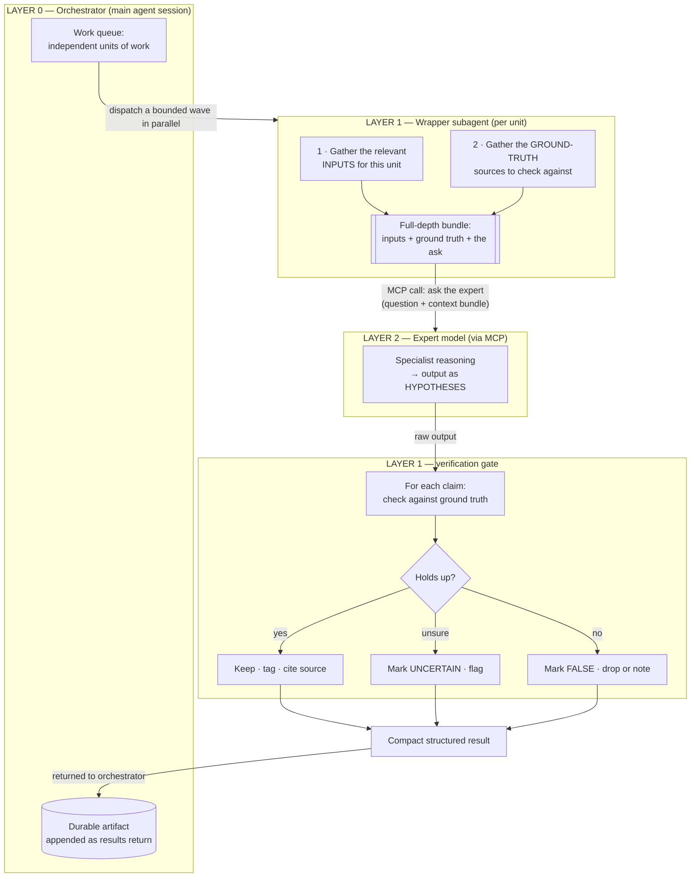

# Two-Layer Cross-Model Expert Pattern

> **What this documents:** a general, reusable way to put an **external "expert" model (reached over
> MCP) to work inside an agent loop** — by wrapping it in orchestrating subagents. The pattern keeps
> the expert's output **parallel, context-cheap, and trustworthy**. In this project the expert is
> reached through the `ask_openrouter` tool; the pattern
> applies to any second-opinion model or any MCP tool whose output is high-value but not
> automatically safe to act on (code review, threat modeling, design critique, research synthesis,
> large-doc analysis, etc.).

---

## TL;DR

```
                ORCHESTRATOR (your main agent session)
                         │  splits work into independent units,
                         │  dispatches a bounded wave in parallel
   ┌─────────────────────┼─────────────────────┐
   ▼                     ▼                     ▼
 Wrapper subagent     Wrapper subagent     Wrapper subagent      ← LAYER 1 (wrapper)
 (gather → call →     (gather → call →     (gather → call →
  verify → report)     verify → report)     verify → report)
   │                     │                     │
   ▼ MCP call            ▼ MCP call            ▼ MCP call
 Expert model         Expert model         Expert model          ← LAYER 2 (expert)
 (via MCP tool)       (via MCP tool)       (via MCP tool)
```

- **Layer 0 — Orchestrator:** your main session. It owns the work queue, decides how to split it,
  fans out a bounded wave of wrapper subagents, and merges their results into one durable artifact.
- **Layer 1 — Wrapper subagent (one per work unit):** assembles a tight input bundle, calls the
  expert, then **verifies the expert's output against ground truth** before returning a compact
  result.
- **Layer 2 — Expert model (over MCP):** the actual specialist — ideally a *different model family*
  from the one doing the building/orchestrating, so its blind spots differ from yours.

The expert does the thinking. The wrapper makes that thinking **parallel, cheap to consume, and
safe to trust**.

---

## How this maps to `openrouter-subagents`

| Layer | In this project |
|---|---|
| **Layer 0 — Orchestrator** | Your main Claude Code session — the one reading this pattern. |
| **Layer 1 — Wrapper subagent** | A Claude subagent (e.g. dispatched via the `Task` tool) per work unit: it gathers the bundle, calls the expert tool, verifies, and reports back compactly. |
| **Layer 2 — Expert (over MCP)** | The `ask_openrouter` tool — `openrouter/fusion` (a panel of models answers in parallel and a judge synthesizes them) or a strong single model (e.g. `anthropic/claude-opus-latest`) with `reasoning_effort: high` for audits/critique/threat-modeling. |

The **cross-model** part matters: the orchestrator and wrappers are Claude; the expert is a *different*
model reached through OpenRouter — and with `openrouter/fusion` it is an entire **panel of different
model families** at once (e.g. Claude + GPT + Gemini), fused by a judge. Different families mean
**different blind spots** — which is the entire value of a second opinion, amplified by Fusion. Treat
the expert's output as hypotheses to check, not facts to adopt; this pattern's verification gate is how
you keep only ground-truth-checked conclusions.

---

## Why wrap the expert (the point of the pattern)

| Concern | Calling the MCP expert directly from your main loop | Wrapping it in subagents |
|---|---|---|
| **Context bloat** | Every input the expert needs gets read into your *main* context → it fills up, summarization/compaction kicks in, you lose working state | Bundle assembly happens **inside each subagent's** context; your main loop only ever sees the compact final result |
| **Parallelism** | Calls from the main loop are effectively serial | Subagents run **truly concurrently** (in bounded waves) |
| **Unverified claims** | Expert output is consumed as-is → unchecked claims get acted on, wasting effort or introducing errors | Subagent **verifies each claim against ground truth** (`VERIFIED` / `FALSE` / `UNCERTAIN`) before it surfaces |
| **Shared blind spots** | If the expert is the same model doing the work, it shares your failure modes | A **different model family** (or a whole Fusion panel) as the expert surfaces issues a self-pass would miss |
| **Durability** | Results live only in the conversation → lost on compaction/restart | Each result is written to a durable artifact as it returns |

---

## How it's meant to be used (data flow)



---

## The five moves

1. **Split** the work into independent units the orchestrator can dispatch without shared state.
2. **Bundle** — each wrapper gathers a *tight, high-signal* input set: the material to analyze **plus
   the ground-truth sources** to check it against. Read only what's relevant (keep it lean), but give
   the expert depth, not a summary.
3. **Call** the expert over MCP with a pointed question + the bundle as context.
4. **Verify** — treat the expert's output as hypotheses. Check each claim against the real
   ground truth and tag it `VERIFIED` / `FALSE` / `UNCERTAIN`.
5. **Aggregate** — return a compact result to the orchestrator, which appends it to a durable
   artifact as each unit completes.

---

## Operating guidelines

- **Bounded waves, not unbounded fan-out.** Run a small number of expert calls concurrently
  (e.g. ~3). Massive parallel dispatch tends to hit MCP/client timeouts and contention; a bounded
  wave is the reliable speed/safety balance. (Note: `openrouter/fusion` is itself slow — it runs a
  panel + a synthesis pass — so keep waves small.)
- **Write results incrementally.** Append each unit's result to the durable artifact *as it returns*
  so a mid-wave failure never loses completed work.
- **Pick an expert from a different model family** than the one building/orchestrating — diverse
  blind spots are the whole point of a second opinion. (Here: Claude orchestrates; the expert is an
  OpenRouter model — or, with `openrouter/fusion`, a multi-model panel.)
- **Use high reasoning effort for the expert** when the task is a deep audit/critique, not a quick
  lookup. With `ask_openrouter`, set `reasoning_effort: high` (and `openrouter/fusion` or a strong
  model) for deep audits.
- **Never skip the verification gate.** A confident wrong answer that gets acted on is worse than no
  answer. The wrapper's job is to make sure only ground-truth-checked conclusions reach the main loop.

---

## When to reach for it

Use this pattern whenever you want an external/second-opinion model (or any MCP tool prone to
confident-but-wrong output) **without** (1) flooding your main context, (2) serializing your work, or
(3) blindly trusting the result. Typical fits: code/security review, design critique, threat
modeling, cross-checking research, or analyzing material too large to hold in the main context.

> **The reusable idea, in one line:** *wrap an external MCP expert in a subagent that bundles → calls
> → verifies, so the main loop only ever sees trustworthy, compact conclusions.*

---

*A rendered, styled version of this diagram lives at
[`html/two-layer-cross-model-expert.html`](./html/two-layer-cross-model-expert.html) — open it in a browser for the
visual walkthrough.*
